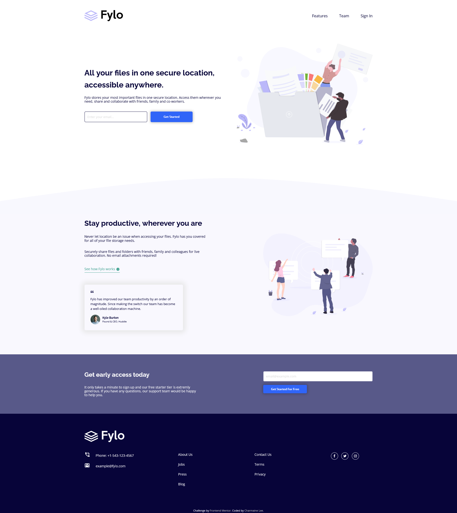

# Frontend Mentor - Fylo landing page with two column layout solution

This is a solution to the [Fylo landing page with two column layout challenge on Frontend Mentor](https://www.frontendmentor.io/challenges/fylo-landing-page-with-two-column-layout-5ca5ef041e82137ec91a50f5). Frontend Mentor challenges help you improve your coding skills by building realistic projects.

## Table of contents

- [Overview](#overview)
  - [The challenge](#the-challenge)
  - [Screenshot](#screenshot)
  - [Links](#links)
- [My process](#my-process)
  - [Built with](#built-with)
  - [What I learned](#what-i-learned)
  - [Continued development](#continued-development)
  - [Useful resources](#useful-resources)
- [Author](#author)
- [Acknowledgments](#acknowledgments)

## Overview

### The challenge

Users should be able to:

- View the optimal layout for the site depending on their device's screen size
- See hover states for all interactive elements on the page

### Screenshot

### Links

- Solution URL: [Solution @GitHub](https://github.com/charmainelhm/frontend-mentor-fylo-landing-page)
- Live Site URL: [Add live site URL here](https://your-live-site-url.com)

## My process

### Built with

- Semantic HTML5 markup
- Flexbox
- CSS Grid
- Mobile-first workflow

### What I learned

This has been a fruitful yet challenging experience for me as it is my first time building a full landing page. Adding a pseudo element to an input element was one of the challenges I have encountered throughout this project, as pseudo element cannot be added directly onto a input element. I have also discovered that in order for the filter property to work correctly on a SVG object, it is recommended that a black filter is applied to the SVG element first before applying a second filter to it. This project has also taught me the importance of dividing the project into smaller parts and from there determine how I should tackle the problem as the landing page is made up of many different components and it can get really messy if no proper planning is done. I also got a first hand experience with using icons from Font Awesome to build the social media icons required for the project which is a really interesting exeperience for me and I hope to learn more about it in the future.

### Continued development

Moving on from this project, I hope to gain more experience in building full websites, understanding how I can better utilise the classes and functions to make my code more readable and flexible. I will also continue to familiarise myself with flex box and grid so that I can utilise them in building desired layouts in the future.

### Useful resources

- [:focus-within](https://css-tricks.com/almanac/selectors/f/focus-within/) - This has helped me a lot when I was trying to build the active state of the input element, where addition text was required when element is in focus. I was introduced to the :focus-within pseudo-element and understand how it is different from the :focus pseudo-element.
- [Complete Guide to Flexbox](https://css-tricks.com/snippets/css/a-guide-to-flexbox/) - Some flex properties are still rather confusing for me, and this guide is especially helpful as they included diagrams in their explanation which made it easier to understand and visualise how the different properties work.

## Author

- LinkedIn - [Charmaine Lee](https://www.linkedin.com/in/charmainelee-huimin/)
- Frontend Mentor - [@charmainelhm](https://www.frontendmentor.io/profile/charmainelhm)

## Acknowledgments

Practice is a very important learning stage in coding, and I want to thank Frontend Mentor(https://www.frontendmentor.io/) for making it easier for me to do that. With their help, I can focus on understanding the different properties in HTML and CSS even though I have very little knowledge on UI and UX design.
